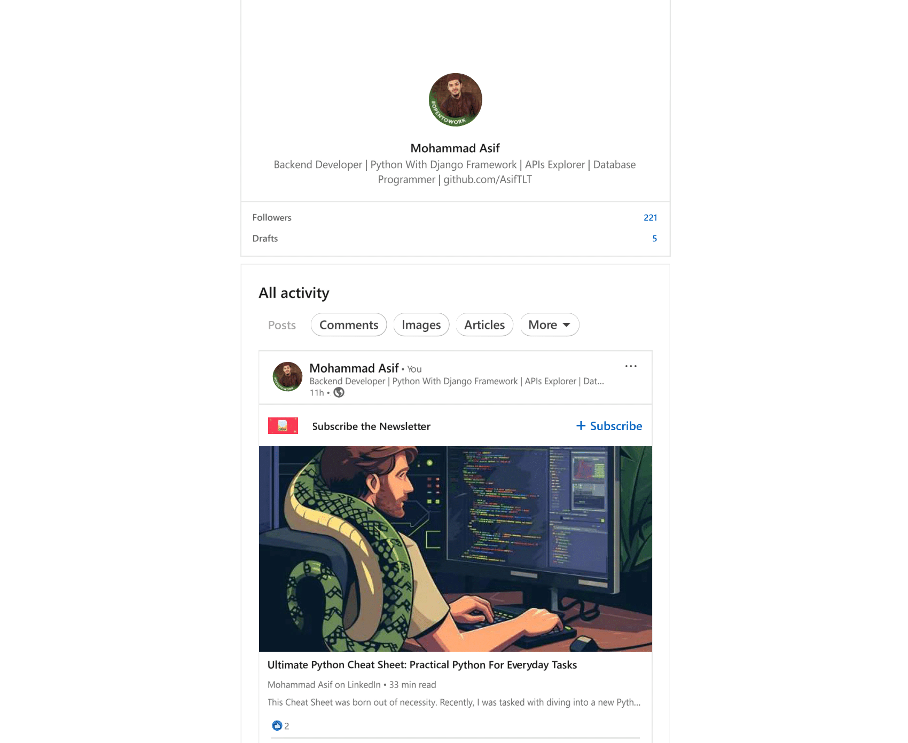

  

<h1 align="center">Hi 👋, I'm Mohammad Asif </h1>
<h3 align="center">A passionate Backend developer from Bangladesh</h3>

  

  

  

 

- 🔭 I’m currently working on [E-Commerce-Website-Python-with-Django]([git@github.com:AsifTLT/Simple-E-Commerce-Website-Python-with-Django.git](https://github.com/AsifTLT/Comprehensive-Django-App))

- 🌱 I’m currently learning **Django, Django Rest Framework**

- 👨‍💻 All of my projects are available at [https://github.com/AsifTLT](https://github.com/AsifTLT)

- 📝 I regularly write articles on [https://www.linkedin.com/newsletters/7212339950288084992/](https://www.linkedin.com/newsletters/7212339950288084992/)

- 💬 Ask me about **Python, Django, Django Rest Framework, API, MYSQL,SQLITE, HTML,CSS,JS,BS**

- 📫 How to reach me **https://www.linkedin.com/in/asifprofile579/**

- 📄 Know about my experiences [https://jlqbypdjqzkx4yez1loifg.on.drv.tw/port/My-Personal-Portfolio.github.io-main/](https://jlqbypdjqzkx4yez1loifg.on.drv.tw/port/My-Personal-Portfolio.github.io-main/)

- ⚡ Fun fact **I Think I Know Everything Unfortunately Everyday I do learning.**

<h3 align="left">Connect with me:</h3>

   </a>   

<h3 align="left">Languages and Tools:</h3>

    
   
 
  
   
        
  
 

 

<!-- <h1 align="center">Bye 👋, Bye</h1> -->
 
